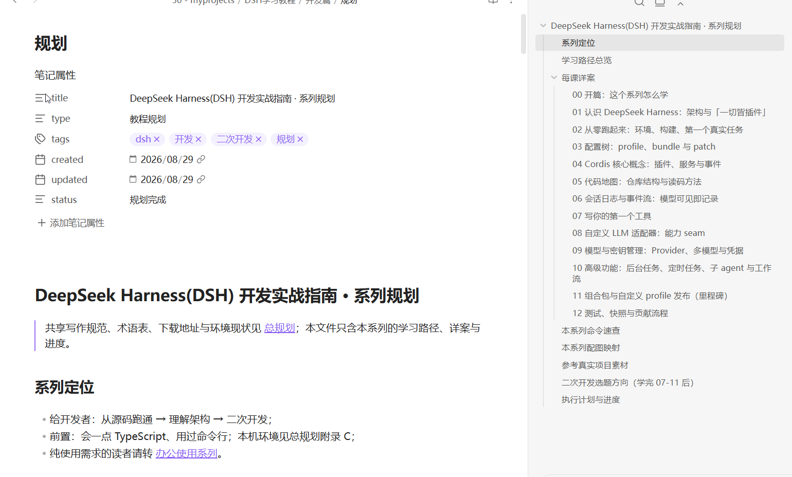
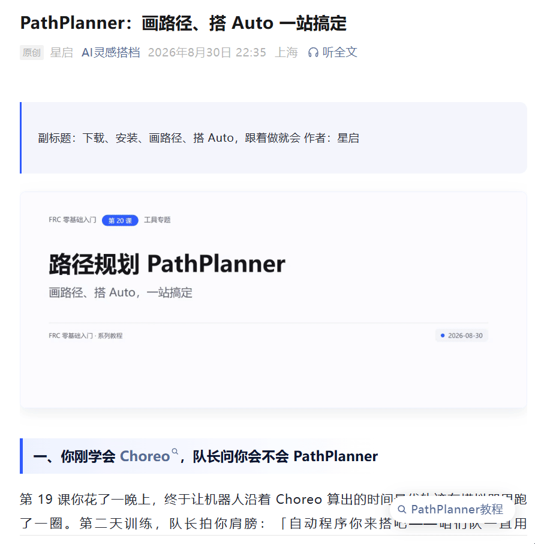

# 从零开始学 XXX - Skill（From Zero Tutorial - Skill）

一个把「零基础系列教程」当作学习产品来生产的 Agent Skill：适用于 Codex、Claude Code、千问办公、CodeBuddy、Trae 等主流 AI 工具。先弄清读者和终点，再规划学习路径，再逐篇写作。每篇都能动手、有完成标志，读者跟着走完就有真实能力。 技能同时支持两种模式：**系列模式**（从零规划多篇学习路径，默认主流程）与**单篇模式**（给一个标题直接成文，适合独立文章/公众号文章）。

## 目录

1. [这个 Skill 是干嘛的？](#1-这个-skill-是干嘛的)
2. [它解决什么问题](#2-它解决什么问题)
3. [核心特性](#3-核心特性)
4. [配图方案（零成本优先）](#4-配图方案零成本优先)
   - [4.1 模板化配图（推荐）](#41-模板化配图推荐)
   - [4.2 Mermaid 示意图](#42-mermaid-示意图)
   - [4.3 实拍截图](#43-实拍截图)
   - [4.4 AI 生图（可选，才计费）](#44-ai-生图可选才计费)
5. [使用效果](#5-使用效果)
   - [5.1 系列文章规划示例效果](#51-系列文章规划示例效果)
   - [5.2 示例公众号文章显示效果](#52-示例公众号文章显示效果)
6. [安装到各 AI 工具](#6-安装到各-ai-工具)
   - [6.1 技能目录对照表](#61-技能目录对照表)
   - [6.2 命令行安装示例](#62-命令行安装示例)
7. [在各 AI 工具中使用示例](#7-在各-ai-工具中使用示例)
   - [7.1 触发示例](#71-触发示例)
   - [7.2 执行流程](#72-执行流程)
8. [快速开始](#8-快速开始)
   - [8.1 安装依赖](#81-安装依赖)
   - [8.2 复制配置并填写凭据](#82-复制配置并填写凭据)
   - [8.3 使用示例](#83-使用示例)
     - [8.3.1 转 HTML](#831-转-html)
     - [8.3.2 配图与内容校验](#832-配图与内容校验)
     - [8.3.3 发布到公众号草稿箱](#833-发布到公众号草稿箱)
9. [目录结构](#9-目录结构)
10. [隐私与安全](#10-隐私与安全)
11. [许可证](#11-许可证)
12. [项目信息](#12-项目信息)

## 1. 这个 Skill 是干嘛的？

你是不是有个想法：想写一套「从零开始学 XXX」的系列教程，比如 Python、摄影、Excel、理财……但真动笔时，脑子里只有主题，不知道：

- 该分几课？每课讲什么？
- 开头怎么讲才不劝退小白？
- 数据不敢乱编，官方资料又懒得查？
- 写到后面忘了前面，前后矛盾？
- 配图、排版、发公众号又是一堆杂活？

**这个 Skill 就是替你把这些「烦人活」全包了。**

你只要告诉 AI 一句：「我想写『从零开始学 Git』系列」，它就会自动——

1. **先帮你做市场调研**（网上搜一圈，看看同类教程怎么写的，避开坑）；
2. **规划完整学习路径**（几课、每课目标、学完能干嘛，像课程大纲一样清晰）；
3. **建立「素材库」**（术语解释、官方链接、真实案例，全部双源核实，不编造）；
4. **一篇一篇写正文**（每篇都有动手环节、完成标志，读者跟着做就有收获）；
5. **自动配图**（封面、正文插图，33 种风格随便选，不用你去找图）；
6. **校验内容**（字数够不够、图片有没有漏、逻辑通不通）；
7. **一键转成微信公众号文章**（排版适配、封面比例自动切、Mermaid 图表转图片）；
8. **甚至帮你发布到公众号草稿箱**（防重复发布，图片自动上传复用）。

只想写一篇独立文章/公众号文章？直接给标题即可（如「写一篇对比 Claude Code 和 Codex 的文章」），技能自动走**单篇模式**：要素确认（主题/目标读者/核心观点）→ 取材核实 → 大纲 + 3 个标题候选即写即报 → 直接成文 → 封面 + 每个正文小节配图 → 校验 → 转 HTML →（可选）发布（全程自动推进，不在大纲处停等确认）；产出统一放在项目根目录 `generated/<英文标题>/`，不建系列规划/素材库（可用轻量「素材.md」留档取材），正文也不写「下一步」。面向公众号传播时自动套用爆款写作规范（标题钩子、前 100 字、金句、行动号召）。

全程你只需要说「开始」，中间可以随时提修改意见，其他机械活儿 AI 全干。

## 2. 它解决什么问题

系列教程常见的坑：想到哪写到哪、默认读者有前置知识、只讲不练、数据编造、写完没人校验。本技能用一条强制流程把这些堵住：**取材先行 → 双源核实 → 规划路径 → 逐篇写作 → 动手验证 → 转 HTML →（可选）发布微信公众号草稿**。 技能会自动路由：系列请求走七步流程，单篇请求走六步流程（见 [SKILL.md](SKILL.md)）。

## 3. 核心特性

- 双模式路由：系列模式七步（取材分析 → 系列规划 → 素材库 → 逐篇写作 → 验证回填 → 转 HTML → 发布微信）；单篇模式六步（要素确认 → 取材 → 大纲 + 3 个标题候选即写即报 → 写作 → 配图 → 校验与收尾）；
- 统一输出目录：写作产出（规划、素材库、文章、图片、HTML）一律放项目根目录 `generated/<英文标题>/`，英文 slug 全小写、连字符分隔；
- 爆款流量密码：面向公众号/公开传播的文章套用传播写作规范（悬念/数字/情绪标题钩子、前 100 字开场、SCQA/黄金圈结构、每 300 字停靠点、每 500 字金句、结尾行动号召与互动话题），且不突破取材先行、双源核实、禁止编造的底线；
- 配图强制（2026-09-03 起）：封面 1 张 + 正文每个一级小节至少 1 张非封面配图，系列/单篇同规则；
- 十条设计原则：无门槛可学、每课有完成标志、术语首现一句话解释、官方资料优先、禁止编造案例与数据；
- 配图引擎：[scripts/cover-generator/](scripts/cover-generator/)，33 套风格的模板化封面/正文卡（HTML→PNG，Playwright 或本机 Edge/Chrome）；
- 微信适配：15 套主题的 md→HTML 转换（默认输出到文章 Markdown 同目录，图片相对路径可直接打开不破图）、Mermaid 渲染为 PNG、封面 2.35:1 比例守卫；
- 公众号草稿发布/更新：防重复发布、UTF-8 中文原文发送、图片 CDN 复用；
- 自动化校验：配图一一对应（0 断链 / 0 未用图 / 缺封面 / 缺正文图 / 缺小节图）、内容厚度 3500-8000 字；单篇/独立文章用 `--strict` 强制。

## 4. 配图方案（零成本优先）

系列/单篇文章必须配图（封面 1 张 + 正文每个一级小节至少 1 张正文图，2026-09-03 起强制），本技能默认走**零 token、零费用**的本地生成通道，且模板化配图、Mermaid、实拍截图、AI 生图可在同一篇内**按内容混用**（模板卡统一主视觉，其余来源补充）：

### 4.1 模板化配图（推荐）

HTML/CSS 模板 + 无头浏览器截图：把标题、副标题、分类、期号填入模板，自动渲染成统一风格的 PNG。零生成成本、品牌一致、完全可控。

- 33 套风格（default + 32 套，清单见 templates/manifest.json），未指定时默认随机；同一篇文章的封面与模板卡共用同一 style（主视觉统一），Mermaid / 截图 / AI 生图可与模板混用；
- 封面 `assets/cover-NN.png`，正文图 `assets/NN/` 一课一目录；
- 内置正文卡模板：card-flow（流程卡）、card-list（列表卡）、card-compare（对比卡）、card-knowledge（知识点卡）；
- 公众号封面必须按 2.35:1 生成（`--width 1068 --height 455`），发布脚本会校验比例。

```powershell
node generate.mjs --style blueprint --series "XXX 零基础入门" --lesson 05 --title "让机器人动起来" --out "assets/cover-05.png"
```

### 4.2 Mermaid 示意图

正文流程图、架构图直接用 Mermaid 写（Obsidian 原生渲染，不产生文件、不消耗 token）；发布公众号前由 md-to-html 自动转成 PNG。

### 4.3 实拍截图

操作类文章必须配真实截图（界面、运行结果、报错原文），禁止用示意图冒充。

### 4.4 AI 生图（可选，才计费）

需要手绘感/真实感的正文插图时才用 AI 生图，属于按量计费的可选项；封面与批量配图默认不走这条路。

完整规范见 [references/images.md](references/images.md)。

## 5. 使用效果

### 5.1 系列文章规划示例效果



**说明**：从零开始学系列的学习路径与课程规划。

### 5.2 示例公众号文章显示效果



**说明**：微信公众号文章预览。

## 6. 安装到各 AI 工具

本技能不是某个 AI 工具的专属格式，而是标准 Agent Skill：目录名 `from-zero-tutorial`、根目录带 `SKILL.md`，Codex、Claude Code、千问办公、CodeBuddy、Trae、WorkBuddy、百度搭子、豆包工作等都能用。克隆或复制到对应工具的技能目录即可被识别（Windows 直接复制整个文件夹，Linux/macOS 也可用符号链接）。

### 6.1 技能目录对照表

| 工具 | 安装位置 / 方式 |
| --- | --- |
| Codex | 个人技能 `C:\Users\<你>\.codex\skills\from-zero-tutorial`（Linux/macOS：`~/.codex/skills/from-zero-tutorial`），或使用 Codex 的 skill 安装器 |
| Claude Code | 个人技能 `~/.claude/skills/from-zero-tutorial`；项目级放 `.claude/skills/` |
| CodeBuddy | 个人技能 `~/.codebuddy/skills/from-zero-tutorial`；项目级放 `.codebuddy/skills/` |
| Trae | 项目级 `.trae/skills/from-zero-tutorial`，或「设置 → Rules and Skills → 导入 SKILL.md」 |
| DeepSeek Harness | 放入 `$DSH_HOME/skills/from-zero-tutorial`；也可在 Web UI「设置 → 插件 → Skills」中从本仓库一键安装 |
| WorkBuddy | 客户端「添加技能」功能导入含 SKILL.md 的技能包（官网：[codebuddy.cn](https://www.codebuddy.cn/home/)），或技能市场安装 |
| 阿里千问办公（QwenWork） | 个人技能 `~/.qwenworkcn/skills/from-zero-tutorial`（Windows：`C:\Users\<你>\.qwenworkcn\skills\`），或在千问办公「技能 → 安装技能」上传 SKILL.md 及辅助文件 |
| 百度搭子（DuMate） | 客户端「技能 → 安装技能」导入含 SKILL.md 的 zip 压缩包（支持拖入 URL）；技能广场可安装内置技能 |
| 豆包工作 | 打开 [豆包工作](https://www.doubao.com/work) → 「技能·连接器·伙伴」安装，或自定义导入含 SKILL.md 的技能包（可将本仓库打包为 zip 导入） |

### 6.2 命令行安装示例

一条命令示例（Claude Code，Linux/macOS）：

```bash
mkdir -p ~/.claude/skills
git clone --depth 1 https://github.com/chengwind198/from-zero-tutorial.git ~/.claude/skills/from-zero-tutorial
```

其他工具同理：把仓库复制/克隆到上表对应目录，目录名保持 `from-zero-tutorial`，各工具会按 [SKILL.md](SKILL.md) 的 description 自动匹配触发。

## 7. 在各 AI 工具中使用示例

安装后无需额外配置，直接对 AI 说需求即可——技能描述包含「从零开始学 XXX / 零基础入门 / 从入门到进阶」等关键词时会自动匹配：

### 7.1 触发示例

- **Codex**：`用 from-zero-tutorial 写「从零开始学 Python」系列教程：先做学习路径规划，再写第一篇「为什么是 Python」。`
- **Claude Code**：`使用 from-zero-tutorial 技能，为「零基础入门 Git」规划一个 8 课系列，然后写第一课。`
- **CodeBuddy**：`用 from-zero-tutorial 写「零基础入门 React」系列：先规划学习路径，再写第一篇。`
- **Trae**：`使用 from-zero-tutorial 技能，为「从零开始学视频剪辑」做系列规划并写第一课。`
- **WorkBuddy**：`用 from-zero-tutorial 写「零基础入门 Excel 函数」系列：先规划学习路径，再写第一篇。`
- **千问办公（QwenWork）**：`使用 from-zero-tutorial 技能，为「从零开始学摄影」做系列规划并写第一课。`

- **Codex（单篇）**：`用 from-zero-tutorial 写一篇独立对比文章：Claude Code、Codex、dsh、WorkBuddy 怎么选？`
- **Claude Code（单篇）**：`使用 from-zero-tutorial，给定标题直接写一篇公众号文章。`

### 7.2 执行流程

触发后技能按请求自动路由：**系列模式**执行要素确认 → web search 取材 → 系列规划（要点版即写即报）→ 素材库 → 逐篇写作 → 配图与校验 → 转 HTML（发布按需）；**单篇模式**执行要素确认 → 取材 → 大纲 + 3 个标题候选即写即报 → 写作 → 封面 + 每个正文小节配图 → 校验收尾 → 转 HTML（发布按需）。产出统一放入项目根目录 `generated/<英文标题>/`；大纲与候选同步给出后一次跑完，不中途分批发文件。关键数据会做双源核实（时效敏感主题以写作日最新信息为准并标注日期），案例与数据禁止编造。

## 8. 快速开始

### 8.1 安装依赖

- Python 3 + `pip install markdown beautifulsoup4 pyyaml requests`；
- Node.js 18+（配图生成需要；Playwright 可选，未装则用本机 Edge/Chrome）。

### 8.2 复制配置并填写凭据

```powershell
Copy-Item config.yaml.example config.yaml
# 编辑 config.yaml，填入 AppID / AppSecret
```

### 8.3 使用示例

在技能根目录执行，`--input` 传你自己的文章路径。

#### 8.3.1 转 HTML

```powershell
python scripts/md-to-html.py --input "<项目根>/generated/<英文标题>/01-数学竞赛是什么.md" --theme refined-blue
```

HTML 默认输出到 Markdown 同目录（`<文章目录>/<文章名>.html`），图片保持相对 `assets/` 路径，直接打开不破图；需要子目录时用 `--html-dir html`（发布/更新草稿流程内部会显式使用 `html/` 子目录）。

#### 8.3.2 配图与内容校验

在系列目录运行（文章默认在项目根目录 `generated/<英文标题>/`，`--root` 指向该目录；脚本在技能根目录运行）：

```powershell
node scripts/check-images.mjs --root "<项目根>/generated/<英文标题>"
node scripts/check-articles.mjs --root "<项目根>/generated/<英文标题>"
```

单篇/独立文章请加 `--strict`，会强制封面、正文每节一图与字数区间：`node scripts/check-images.mjs --root "<项目根>/generated/<英文标题>" --strict`、`node scripts/check-articles.mjs --root "<项目根>/generated/<英文标题>" --strict`（示例见 references/single-mode.md）。

#### 8.3.3 发布到公众号草稿箱

先干跑核对账号/标题/图片：

```powershell
python scripts/publish-wechat.py --input "<项目根>/generated/<英文标题>/01-数学竞赛是什么.md" --dry-run
```

完整用法见 [SKILL.md](SKILL.md)（技能主文档：铁律、七步流程、输出目录、设计原则）与 [references/](references/)（规划 / 单篇写作 / 配图 / 发布 / 爆款流量密码规范）。

## 9. 目录结构

| 路径 | 说明 |
| --- | --- |
| [SKILL.md](SKILL.md) | 技能主文档 |
| [references/](references/) | 规划、单篇写作、配图、发布、爆款流量密码的详细规范 |
| [assets/templates/](assets/templates/) | 系列规划、素材库、系列文章模板、单篇文章模板（article-single-template，无 lesson） |
| [scripts/](scripts/) | md→HTML、微信发布/更新、配图与内容校验脚本 |
| [scripts/cover-generator/](scripts/cover-generator/) | 模板化配图引擎（33 套风格 + 正文卡模板） |
| [themes/](themes/) | 15 套微信 HTML 主题 |
| [config.yaml.example](config.yaml.example) | 发布配置模板（真实配置 `config.yaml` 不入库） |
| generated/<英文标题>/ | 运行期生成的系列/单篇写作产出：系列规划、素材库、文章、assets/、html/（英文 slug 全小写、连字符分隔） |

## 10. 隐私与安全

- `config.yaml` 含公众号 AppSecret，已加入 `.gitignore`，**绝不提交**；
- `draft-records.json` / `draft-records.backup.json` 含本机路径与图片映射，是本地运行数据，已加入 `.gitignore`，脚本会自动创建；
- 写作铁律：关键数据双源核实、禁止编造案例/数据/对话；截图注意裁掉用户名、路径、密钥。

## 11. 许可证

本项目采用 [Apache License 2.0](LICENSE) 开源（Copyright 2026 chengwind198）。

## 12. 项目信息

- GitHub：[https://github.com/chengwind198/from-zero-tutorial](https://github.com/chengwind198/from-zero-tutorial)
- 微信公众号：AI灵感搭档
